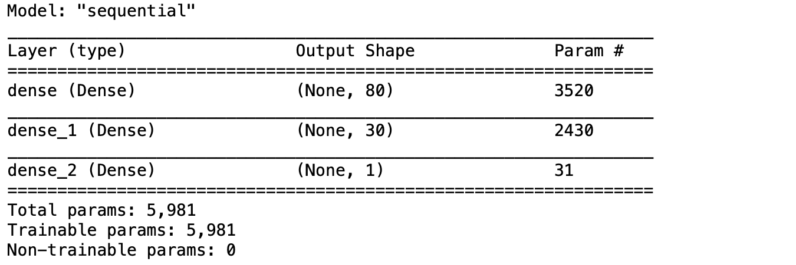
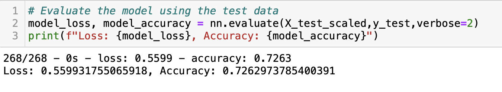
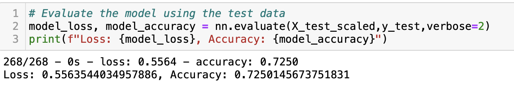
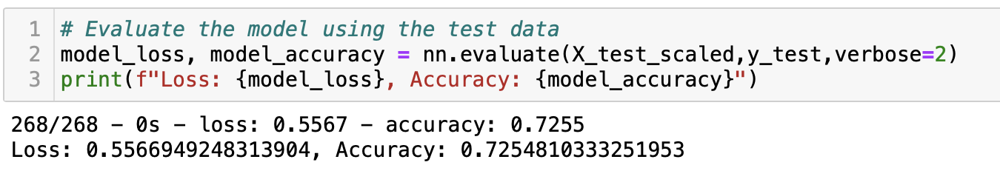
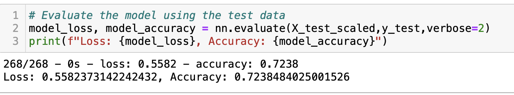

# Neural_Network_Charity_Analysis

## Overview of the analysis

### Purpose

The purpose of this project is to use deep-learning neural network model in Python to analyze the loan prediction risk. The following methods were used in this project:
- Data Preprocessing
- compile, train and evaluate the model
- optimize the model

### Technology

Python, Jupyter notebook, Pandas, Tensorflow, sklearn

## Results: 

### Data Preprocessing

- What variable(s) are considered the target(s) for your model?
  - IS_SUCCESSFUL 
- What variable(s) are considered to be the features for your model?
  - APPLICATION_TYPE
  - AFFILIATION
  - CLASSIFICATION
  - USE_CASE
  - ORGANIZATION
  - STATUS
  - INCOME_AMT
  - SPECIAL_CONSIDERATION
  - ASK_AMT
- What variable(s) are neither targets nor features, and should be removed from the input data?
  - EIN
  - NAME

### Compiling, Training, and Evaluating the Model

- How many neurons, layers, and activation functions did you select for your neural network model, and why?
  - Since the total number of features for input data is 43, the total number of neurons should be 2~3 times as many as features, therefore, two hidden layers with 80 and 30 neurons respectively were used in my model.
  - 
- Were you able to achieve the target model performance?
  - No, the expected model accuracy is 75%, however, the highest model accuracy for my model is 72.6% .
  - 
- What steps did you take to try and increase model performance?
  - Adding more neutrons in each layer
  - Adding more hidden layers
  - Change its activation function for hidden layer 2.

## Summary

### Model Performance before optimization

The model accuracy before optimization was 72.50%

### Model Performance after optimization
- Adding more neutrons
  - 
  - The model accuracy after optimization by adding more neutrons became 72.55%, which increased by 0.05%.
- Adding more hidden layers
  - 
  - The model accuracy after optimization by adding more hidden layers became 72.63%, which increased by 0.08%.
- Change its activation function
  - 
  - The model accuracy after optimization by changing its activation function from RELU to TANH for hidden layer 2 became 72.38%, which decreased by 0.12%.

In conclusion, adding more neutrons and more hidden layers does increase the model performance, but very limited. The model performance was even decreased after changing its activation function. Therefore, the combination of pre-processing the categorical variables through binning/bucketing and adding more neutron/hidden layer with altering activation function may improve its model performance and reach 75% accuracy. 

### Recommendation

Since this is a binary classification with clear target outcome problem, the supervise machine learning model with a higher interpretability, such as random forest, could be used in the future and may has a better performance.
